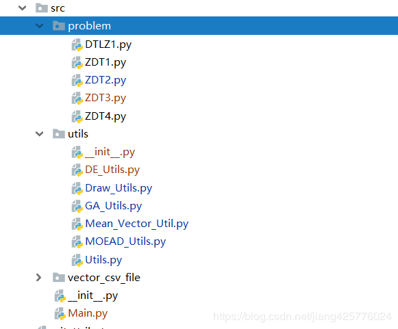
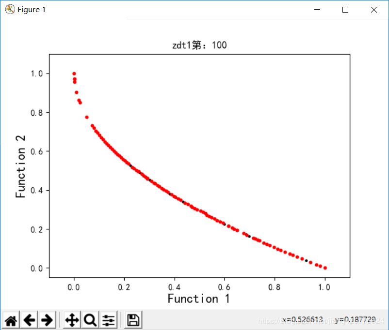
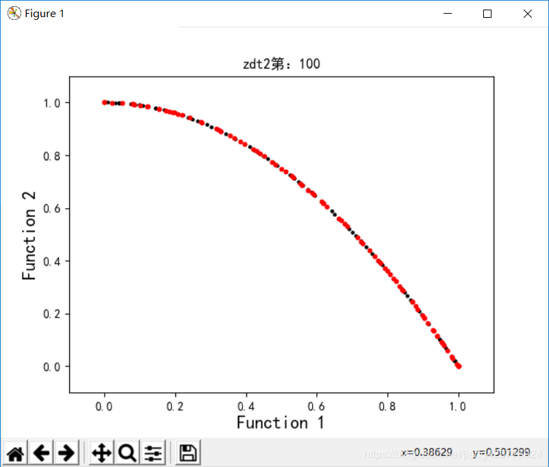
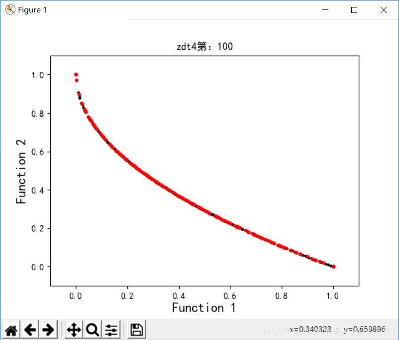

## MOEAD-python动态+bilibili视频讲解😄

### 有不能理解的可以加QQ一起沟通


本代码是对[MOEA/D: A Multiobjective Evolutionary Algorithm Based on Decomposition](https://ieeexplore.ieee.org/document/4358754)论文中算法编程实现。（也许是：全网第一个python&可视化版本）


MOEAD算法论文大致介绍详细，这个中文的帖子也不错：[https://blog.csdn.net/sinat_33231573/article/details/80271801](https://blog.csdn.net/sinat_33231573/article/details/80271801)

**不过自己实现中发现，坑点至少有2个：**
1.**如何生成均匀权向量**，这个在**Mean_Vector_Utils.py**文件中已经实现，可以直接用，大致是用一个拔插法的思想，我的另一个帖子也说了下怎么生成的一个效果：[MOEAD算法中均匀权向量的实现---Python](https://blog.csdn.net/jiang425776024/article/details/84528415)。
2.**如何产生下一代解y**，这个处理的不好几乎做不到论文中那样完美的Pareto前沿面效果，论文中也只是说了一句话：产生新解o(╥﹏╥)o，我这里用了当目标优化的遗传GA加极值优化EO产生下一代，效果尚可，2个30维函数的目标联合优化，只需要100代，1-2秒钟左右即可找到较完美的解，3目标的DTLZ1的pareto前沿形状找的很完美，但是解还是差太多，可是是哪里出了问题。持续改进中。


## bilibili本代码视频

（确保）已经基本了解MOEAD和看了本代码了

[MOEAD bilibili](https://www.bilibili.com/video/BV1Rf4y117Zk/)


**代码结构：**
problem：求解问题函数目录
vector_csv_file:求解问题的均匀权向量生成目录

ZDT1:


ZDT2:


ZDT4:


DTLZ1:


**MOEA/D算法:**

**（我这只简单介绍，详情网上、paper看，然后再看这代+b站视频，这样会好点。希望能帮到你！）**

```
输入: 
•多目标优化 
•停止标准;
•N: MOEA/D考虑的子问题的数量
•N个权重向量的均匀分布: λ1,...,λN；
•T:每个权重向量的附近的权重向量的数量
输出:EP

步骤1) 初始化:
第1.1 步)创建一个外部种群（EP）用于存储过程优秀个体，初始为空
第1.2 步)计算任何两个权重向量之间的欧氏距离，然后计算出每个权重向量的最近权重向量T。对于每个i=1,…,N,设置
B(i)={i1,...,iT},其中λi1,,..,λiT是λi的最近T权重向量
第1.3 步)生成初始数量的随机的x1,...,xN或特定问题的方法。设置FVi=F(xi) 
第1.4 步)由特定于问题的方法初始化z=(z1,...,zm)T。
步骤2) 更新：
对于i =1,…,N
步骤2.1) 复制: 从B(i)随机选择两个索引k,l，然后通过使用差分进化从xk和xl生成一个新的解决方案y。
步骤2.2) 改进: 应用特定于问题的修复/改进启发式由y 产生y’
步骤2.3) 更新Z：对于每一个j=1,...,m,判断y是否可能替换原有极值，如果zj<fj(y’)，则设置zj=fj(y’)
步骤2.4)更新领域解B(i)，对于领域中每个权值向量λj，如果得到优化，则更新；
步骤2.5) 更新EP：从EP中删除所有被F(y’)支配的向量。如果外部种群 (EP)中没有支配F(y’)的向量，则将F(y’)添加至EP
步骤3) 停止条件: 如果满足停止条件,则停止和输出EP。否则，重复步骤 2
在初始化中, B(i)包含λi的T最近向量。我们使用欧几里德距离来测量任何两个权重向量之间的接近程度。因此，λi的最近向量是它自己，其中i∈B(i)。如果j∈B(i),则第j个子问题可以看作是子问题i的近邻。

```

